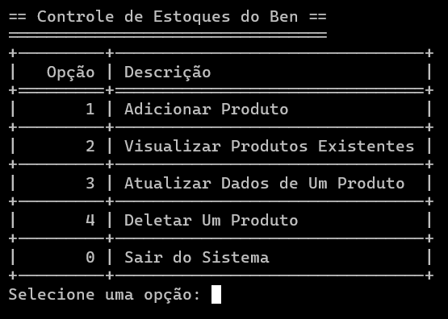

<h1> === SISTEMA CRUD BÁSICO === </h1>
 
O Sistema CRUD Básico é um projeto simples, mas eficiente, que permite gerenciar um estoque de produtos de forma intuitiva. Ele foi desenvolvido utilizando Python e JSON, garantindo a persistência dos dados mesmo após o fechamento do programa.

 
<h3> Foram utilizados dois arquivos principais: </h3>

1) main.py

- Responsável pela interação do usuário com o sistema. Ele apresenta um menu de opções que permite adicionar, visualizar, atualizar e excluir produtos do estoque. Utiliza a biblioteca tabulate para exibir os dados de forma organizada e legível. O sistema permanece em execução até que o usuário escolha sair.

 
2) crud.py

- O "coração" do projeto. Contém todas as funcionalidades do CRUD (Create, Read, Update, Delete):

- - Adicionar Produto: Recebe dados do usuário, gera um ID aleatório para o produto e o salva no arquivo JSON.

- - Visualizar Produtos: Exibe todos os produtos cadastrados em formato de tabela.

- - Atualizar Produto: Permite alterar nome, quantidade ou preço de um produto.

- - Excluir Produto: Remove um produto do estoque após confirmação do usuário.

- - Salvar e Carregar Dados: Os dados são armazenados e lidos de um arquivo JSON, garantindo a persistência das informações.

 
<h3> 🛠 Tecnologias e Conceitos Utilizados </h3>

- Manipulação de JSON – Persistência de dados de forma estruturada.

- Funções e Classes – Modularização do código para maior organização e reutilização.

- Tabulate – Exibição de informações em formato de tabela.

- Tratamento de Erros – Uso de try/except para prevenir falhas com entradas inválidas.

- Geração de ID Aleatório – Cria identificadores únicos para os produtos.

- Entrada e Saída de Dados – Interação com o usuário por meio de input() e print().

  
<h3>🚀 Habilidades Aplicadas </h3>
 
✅ Lógica de Programação – Implementação de operações CRUD com fluxos lógicos bem definidos.

✅ Organização e Estrutura do Código – Uso de classes e funções para facilitar a manutenção.

✅ Manipulação de Arquivos – Armazenamento e leitura de dados de um arquivo JSON.

✅ Tratamento de Erros – Validação de entradas para evitar problemas na execução do programa.

✅ Melhoria na Experiência do Usuário – Interface textual clara e intuitiva.
 
📌 Exemplo de Execução do Sistema

